```mermaid
graph LR
linkStyle default interpolate basis
  92190279([ATIDataCollectorActor]) -- StartATIParsingMessage --> 1022359133([ATIParserActor])
  -1707415808([DemounterDataCollectorActor]) -- StartDemounterParserMessage --> 2073596543([DemounterParserActor])
  1489592356([InspectionLoaderServiceCore]) -- StartServiceMessage --> 422767288([ServiceActor])
  422767288([ServiceActor]) -- StartServiceMessage --> 422767288([ServiceActor])
  1489592356([InspectionLoaderServiceCore]) -- StopServiceMessage --> 422767288([ServiceActor])
  2073596543([DemounterParserActor]) -- StartDemounterFtpCollectorMessage --> -931298200([DemounterFtpCollectorActor])
  422767288([ServiceActor]) -- StartStockerDataCollectorMessage --> 1136059617([StockerDataCollectorActor])
  1136059617([StockerDataCollectorActor]) -- StartStockerDataCollectorMessage --> 1136059617([StockerDataCollectorActor])
  1136059617([StockerDataCollectorActor]) -- StartStockerPasingMessage --> -597197897([StockerParserActor])
  -962559673([SmfParserActor]) -- StartATIFtpCollectorMessage --> -1420816091([ATIFtpCollectorActor])
  1022359133([ATIParserActor]) -- StartATIFtpCollectorMessage --> -1420816091([ATIFtpCollectorActor])
  -597197897([StockerParserActor]) -- StockerTransfer --> 1123033683([FTPTransferActor])
  1123033683([FTPTransferActor]) -- AtiSaveDB --> 1238347176([SaveDBActor])
  1123033683([FTPTransferActor]) -- DemounterSaveDB --> 1238347176([SaveDBActor])
  1123033683([FTPTransferActor]) -- StockerSaveDB --> 1238347176([SaveDBActor])
  -1420816091([ATIFtpCollectorActor]) -- AtiTransfer --> 1123033683([FTPTransferActor])
  -931298200([DemounterFtpCollectorActor]) -- DemounterTransfer --> 1123033683([FTPTransferActor])
  -72085629([DeepLearningTrainingServiceCore]) -- StartServiceMessage --> 1609903615([ServiceActor])
  1609903615([ServiceActor]) -- StartServiceMessage --> 1609903615([ServiceActor])
  1264796215([FtpTransferActor]) -- StartServiceMessage --> 1609903615([ServiceActor])
  -72085629([DeepLearningTrainingServiceCore]) -- StopServiceMessage --> 1609903615([ServiceActor])
  1609903615([ServiceActor]) -- StopServiceMessage --> 1609903615([ServiceActor])
  -1429991637([LtImageCreateActor]) -- StartFileCreateMessage --> 1400521902([FileCreateActor])
  -2051305175([AtiImageCreateActor]) -- StartFileCreateMessage --> 1400521902([FileCreateActor])
  539934075([KlaImageCreateActor]) -- StartFileCreateMessage --> 1400521902([FileCreateActor])
  -1429991637([LtImageCreateActor]) -- FailServiceMessage --> 1609903615([ServiceActor])
  1970373231([LearningDataSelectActor]) -- FailServiceMessage --> 1609903615([ServiceActor])
  -908320094([ImageSeparateActor]) -- FailServiceMessage --> 1609903615([ServiceActor])
  -2051305175([AtiImageCreateActor]) -- FailServiceMessage --> 1609903615([ServiceActor])
  469863349([ImageDownLoadActor]) -- FailServiceMessage --> 1609903615([ServiceActor])
  1264796215([FtpTransferActor]) -- FailServiceMessage --> 1609903615([ServiceActor])
  539934075([KlaImageCreateActor]) -- FailServiceMessage --> 1609903615([ServiceActor])
  1400521902([FileCreateActor]) -- FailServiceMessage --> 1609903615([ServiceActor])
  1970373231([LearningDataSelectActor]) -- StartImageDownLoadMessage --> 469863349([ImageDownLoadActor])
  1609903615([ServiceActor]) -- StartLearningDataSelectMessage --> 1970373231([LearningDataSelectActor])
  -908320094([ImageSeparateActor]) -- StartKlaImageCreateMessage --> 539934075([KlaImageCreateActor])
  -908320094([ImageSeparateActor]) -- StartLtImageCreateMessage --> -1429991637([LtImageCreateActor])
  -908320094([ImageSeparateActor]) -- StartAtiImageCreateMessage --> -2051305175([AtiImageCreateActor])
  469863349([ImageDownLoadActor]) -- StartImageSeparateMessage --> -908320094([ImageSeparateActor])
  1400521902([FileCreateActor]) -- StartFtpTransferMessage --> 1264796215([FtpTransferActor])
  -408373823([FTPInterfaceActor]) -- StartUnZippingMessage --> -596503300([ZipActor])
  -408373823([FTPInterfaceActor]) -- StartGenerateSMFMessage --> 1624341626([GenerateSMFActor])
  -1767907903([DBInterfaceActor]) -- ReplyMaskDataMessage --> 1624341626([GenerateSMFActor])
```
# 1. Messages
## Mirero.IRIS.Akka.InspectionLoader.Service.Actors.ATIParser.StartATIParsingMessage
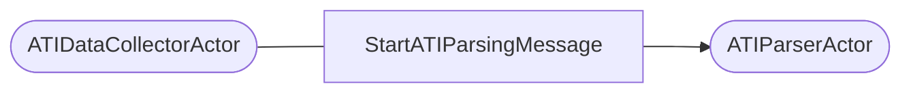
- Sender
  - [Mirero.IRIS.Akka.InspectionLoader.Service.Actors.ATIDataCollector.ATIDataCollectorActor](#mireroirisakkainspectionloaderserviceactorsatidatacollectoratidatacollectoractor) (1)
     - C:\Workspace\iris_review\Mirero.IRIS.Akka.Service\Mirero.IRIS.Akka.InspectionLoader.Service\Actors\ATIDataCollector\ATIDataCollectorActor.cs#L38
- Receiver
  - [Mirero.IRIS.Akka.InspectionLoader.Service.Actors.ATIParser.ATIParserActor](#mireroirisakkainspectionloaderserviceactorsatiparseratiparseractor) (1)

## Mirero.IRIS.Akka.InspectionLoader.Service.Actors.DemounterParser.StartDemounterParserMessage

- Sender
  - [Mirero.IRIS.Akka.InspectionLoader.Service.Actors.DemounterDataCollector.DemounterDataCollectorActor](#mireroirisakkainspectionloaderserviceactorsdemounterdatacollectordemounterdatacollectoractor) (1)
     - C:\Workspace\iris_review\Mirero.IRIS.Akka.Service\Mirero.IRIS.Akka.InspectionLoader.Service\Actors\DemounterDataCollector\DemounterDataCollector.cs#L33
- Receiver
  - [Mirero.IRIS.Akka.InspectionLoader.Service.Actors.DemounterParser.DemounterParserActor](#mireroirisakkainspectionloaderserviceactorsdemounterparserdemounterparseractor) (1)

## Mirero.IRIS.Akka.InspectionLoader.Service.Actors.Service.StartServiceMessage
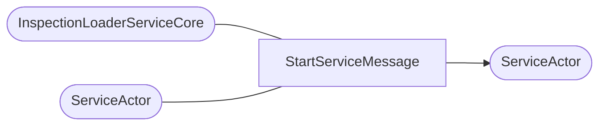
- Sender
  - [Mirero.IRIS.Akka.InspectionLoader.Service.InspectionLoaderServiceCore](#mireroirisakkainspectionloaderserviceinspectionloaderservicecore) (2)
     - C:\Workspace\iris_review\Mirero.IRIS.Akka.Service\Mirero.IRIS.Akka.InspectionLoader.Service\InspectionLoaderServiceCore.cs#L45
     - C:\Workspace\iris_review\Mirero.IRIS.Akka.Service\Mirero.IRIS.Akka.InspectionLoader.Service\InspectionLoaderServiceCore.cs#L57
  - [Mirero.IRIS.Akka.InspectionLoader.Service.InspectionLoaderServiceCore](#mireroirisakkainspectionloaderserviceinspectionloaderservicecore) (2)
     - C:\Workspace\iris_review\Mirero.IRIS.Akka.Service\Mirero.IRIS.Akka.InspectionLoader.Service\InspectionLoaderServiceCore.cs#L45
     - C:\Workspace\iris_review\Mirero.IRIS.Akka.Service\Mirero.IRIS.Akka.InspectionLoader.Service\InspectionLoaderServiceCore.cs#L57
  - [Mirero.IRIS.Akka.InspectionLoader.Service.Actors.Service.ServiceActor](#mireroirisakkainspectionloaderserviceactorsserviceserviceactor) (1)
     - C:\Workspace\iris_review\Mirero.IRIS.Akka.Service\Mirero.IRIS.Akka.InspectionLoader.Service\Actors\Service\ServiceActor.cs#L252
- Receiver
  - [Mirero.IRIS.Akka.InspectionLoader.Service.Actors.Service.ServiceActor](#mireroirisakkainspectionloaderserviceactorsserviceserviceactor) (1)

## Mirero.IRIS.Akka.InspectionLoader.Service.Actors.Service.StopServiceMessage

- Sender
  - [Mirero.IRIS.Akka.InspectionLoader.Service.InspectionLoaderServiceCore](#mireroirisakkainspectionloaderserviceinspectionloaderservicecore) (1)
     - C:\Workspace\iris_review\Mirero.IRIS.Akka.Service\Mirero.IRIS.Akka.InspectionLoader.Service\InspectionLoaderServiceCore.cs#L51
- Receiver
  - [Mirero.IRIS.Akka.InspectionLoader.Service.Actors.Service.ServiceActor](#mireroirisakkainspectionloaderserviceactorsserviceserviceactor) (1)

## Mirero.IRIS.Akka.InspectionLoader.Service.Actors.DemounterFtpCollector.StartDemounterFtpCollectorMessage

- Sender
  - [Mirero.IRIS.Akka.InspectionLoader.Service.Actors.DemounterParser.DemounterParserActor](#mireroirisakkainspectionloaderserviceactorsdemounterparserdemounterparseractor) (1)
     - C:\Workspace\iris_review\Mirero.IRIS.Akka.Service\Mirero.IRIS.Akka.InspectionLoader.Service\Actors\DemounterParser\DemounterParserActor.cs#L43
- Receiver
  - [Mirero.IRIS.Akka.InspectionLoader.Service.Actors.DemounterFtpCollector.DemounterFtpCollectorActor](#mireroirisakkainspectionloaderserviceactorsdemounterftpcollectordemounterftpcollectoractor) (1)

## Mirero.IRIS.Akka.InspectionLoader.Service.Actors.StockerDataCollector.StockerDataCollectorActor.StartStockerDataCollectorMessage
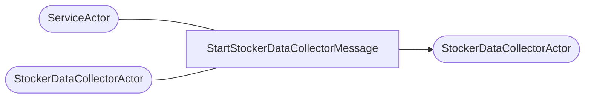
- Sender
  - [Mirero.IRIS.Akka.InspectionLoader.Service.Actors.Service.ServiceActor](#mireroirisakkainspectionloaderserviceactorsserviceserviceactor) (1)
     - C:\Workspace\iris_review\Mirero.IRIS.Akka.Service\Mirero.IRIS.Akka.InspectionLoader.Service\Actors\Service\ServiceActor.cs#L123
  - [Mirero.IRIS.Akka.InspectionLoader.Service.Actors.StockerDataCollector.StockerDataCollectorActor](#mireroirisakkainspectionloaderserviceactorsstockerdatacollectorstockerdatacollectoractor) (2)
     - C:\Workspace\iris_review\Mirero.IRIS.Akka.Service\Mirero.IRIS.Akka.InspectionLoader.Service\Actors\StockerDataCollector\StockerDataCollectorActor.cs#L45
     - C:\Workspace\iris_review\Mirero.IRIS.Akka.Service\Mirero.IRIS.Akka.InspectionLoader.Service\Actors\StockerDataCollector\StockerDataCollectorActor.cs#L50
  - [Mirero.IRIS.Akka.InspectionLoader.Service.Actors.StockerDataCollector.StockerDataCollectorActor](#mireroirisakkainspectionloaderserviceactorsstockerdatacollectorstockerdatacollectoractor) (2)
     - C:\Workspace\iris_review\Mirero.IRIS.Akka.Service\Mirero.IRIS.Akka.InspectionLoader.Service\Actors\StockerDataCollector\StockerDataCollectorActor.cs#L45
     - C:\Workspace\iris_review\Mirero.IRIS.Akka.Service\Mirero.IRIS.Akka.InspectionLoader.Service\Actors\StockerDataCollector\StockerDataCollectorActor.cs#L50
- Receiver
  - [Mirero.IRIS.Akka.InspectionLoader.Service.Actors.StockerDataCollector.StockerDataCollectorActor](#mireroirisakkainspectionloaderserviceactorsstockerdatacollectorstockerdatacollectoractor) (1)

## Mirero.IRIS.Akka.InspectionLoader.Service.Actors.StockerParser.StockerParserActor.StartStockerPasingMessage

- Sender
  - [Mirero.IRIS.Akka.InspectionLoader.Service.Actors.StockerDataCollector.StockerDataCollectorActor](#mireroirisakkainspectionloaderserviceactorsstockerdatacollectorstockerdatacollectoractor) (1)
     - C:\Workspace\iris_review\Mirero.IRIS.Akka.Service\Mirero.IRIS.Akka.InspectionLoader.Service\Actors\StockerDataCollector\StockerDataCollectorActor.cs#L213
- Receiver
  - [Mirero.IRIS.Akka.InspectionLoader.Service.Actors.StockerParser.StockerParserActor](#mireroirisakkainspectionloaderserviceactorsstockerparserstockerparseractor) (1)

## Mirero.IRIS.Akka.InspectionLoader.Service.Actors.ATIFtpCollector.StartATIFtpCollectorMessage
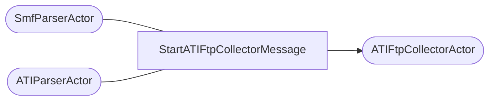
- Sender
  - [Mirero.IRIS.Akka.InspectionLoader.Service.Actors.SmfParser.SmfParserActor](#mireroirisakkainspectionloaderserviceactorssmfparsersmfparseractor) (1)
     - C:\Workspace\iris_review\Mirero.IRIS.Akka.Service\Mirero.IRIS.Akka.InspectionLoader.Service\Actors\SmfParser\SmfParserActor.cs#L43
  - [Mirero.IRIS.Akka.InspectionLoader.Service.Actors.ATIParser.ATIParserActor](#mireroirisakkainspectionloaderserviceactorsatiparseratiparseractor) (1)
     - C:\Workspace\iris_review\Mirero.IRIS.Akka.Service\Mirero.IRIS.Akka.InspectionLoader.Service\Actors\ATIParser\ATIParserActor.cs#L50
- Receiver
  - [Mirero.IRIS.Akka.InspectionLoader.Service.Actors.ATIFtpCollector.ATIFtpCollectorActor](#mireroirisakkainspectionloaderserviceactorsatiftpcollectoratiftpcollectoractor) (1)

## Mirero.IRIS.Akka.InspectionLoader.Service.Actors.TransferData.FTPTransferActor.StockerTransfer

- Sender
  - [Mirero.IRIS.Akka.InspectionLoader.Service.Actors.StockerParser.StockerParserActor](#mireroirisakkainspectionloaderserviceactorsstockerparserstockerparseractor) (1)
     - C:\Workspace\iris_review\Mirero.IRIS.Akka.Service\Mirero.IRIS.Akka.InspectionLoader.Service\Actors\StockerParser\StockerParserActor.cs#L60
- Receiver
  - [Mirero.IRIS.Akka.InspectionLoader.Service.Actors.TransferData.FTPTransferActor](#mireroirisakkainspectionloaderserviceactorstransferdataftptransferactor) (1)

## Mirero.IRIS.Akka.InspectionLoader.Service.Actors.SaveDB.SaveDBActor.AtiSaveDB
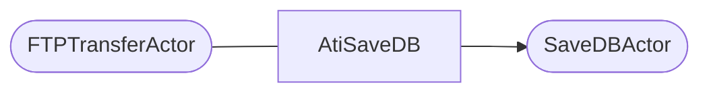
- Sender
  - [Mirero.IRIS.Akka.InspectionLoader.Service.Actors.TransferData.FTPTransferActor](#mireroirisakkainspectionloaderserviceactorstransferdataftptransferactor) (1)
     - C:\Workspace\iris_review\Mirero.IRIS.Akka.Service\Mirero.IRIS.Akka.InspectionLoader.Service\Actors\TransferData\FTPTransferActor.cs#L117
- Receiver
  - [Mirero.IRIS.Akka.InspectionLoader.Service.Actors.SaveDB.SaveDBActor](#mireroirisakkainspectionloaderserviceactorssavedbsavedbactor) (1)

## Mirero.IRIS.Akka.InspectionLoader.Service.Actors.SaveDB.SaveDBActor.DemounterSaveDB
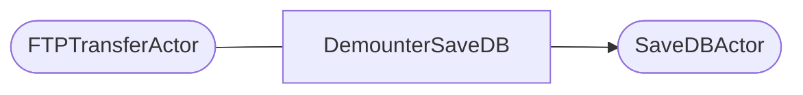
- Sender
  - [Mirero.IRIS.Akka.InspectionLoader.Service.Actors.TransferData.FTPTransferActor](#mireroirisakkainspectionloaderserviceactorstransferdataftptransferactor) (1)
     - C:\Workspace\iris_review\Mirero.IRIS.Akka.Service\Mirero.IRIS.Akka.InspectionLoader.Service\Actors\TransferData\FTPTransferActor.cs#L168
- Receiver
  - [Mirero.IRIS.Akka.InspectionLoader.Service.Actors.SaveDB.SaveDBActor](#mireroirisakkainspectionloaderserviceactorssavedbsavedbactor) (1)

## Mirero.IRIS.Akka.InspectionLoader.Service.Actors.SaveDB.SaveDBActor.StockerSaveDB
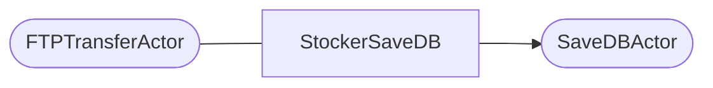
- Sender
  - [Mirero.IRIS.Akka.InspectionLoader.Service.Actors.TransferData.FTPTransferActor](#mireroirisakkainspectionloaderserviceactorstransferdataftptransferactor) (1)
     - C:\Workspace\iris_review\Mirero.IRIS.Akka.Service\Mirero.IRIS.Akka.InspectionLoader.Service\Actors\TransferData\FTPTransferActor.cs#L243
- Receiver
  - [Mirero.IRIS.Akka.InspectionLoader.Service.Actors.SaveDB.SaveDBActor](#mireroirisakkainspectionloaderserviceactorssavedbsavedbactor) (1)

## Mirero.IRIS.Akka.InspectionLoader.Service.Actors.TransferData.FTPTransferActor.AtiTransfer
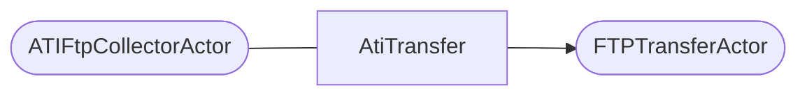
- Sender
  - [Mirero.IRIS.Akka.InspectionLoader.Service.Actors.ATIFtpCollector.ATIFtpCollectorActor](#mireroirisakkainspectionloaderserviceactorsatiftpcollectoratiftpcollectoractor) (1)
     - C:\Workspace\iris_review\Mirero.IRIS.Akka.Service\Mirero.IRIS.Akka.InspectionLoader.Service\Actors\ATIFtpCollector\ATIFtpCollectorActor.cs#L68
- Receiver
  - [Mirero.IRIS.Akka.InspectionLoader.Service.Actors.TransferData.FTPTransferActor](#mireroirisakkainspectionloaderserviceactorstransferdataftptransferactor) (1)

## Mirero.IRIS.Akka.InspectionLoader.Service.Actors.TransferData.FTPTransferActor.DemounterTransfer
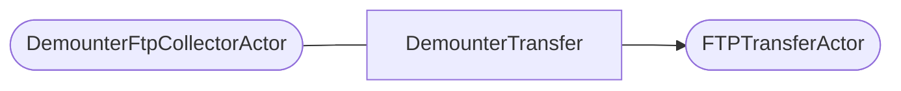
- Sender
  - [Mirero.IRIS.Akka.InspectionLoader.Service.Actors.DemounterFtpCollector.DemounterFtpCollectorActor](#mireroirisakkainspectionloaderserviceactorsdemounterftpcollectordemounterftpcollectoractor) (1)
     - C:\Workspace\iris_review\Mirero.IRIS.Akka.Service\Mirero.IRIS.Akka.InspectionLoader.Service\Actors\DemounterFtpCollector\DemounterFtpCollectorActor.cs#L71
- Receiver
  - [Mirero.IRIS.Akka.InspectionLoader.Service.Actors.TransferData.FTPTransferActor](#mireroirisakkainspectionloaderserviceactorstransferdataftptransferactor) (1)

## Mirero.IRIS.Akka.InspectionLoader.Service.Actors.ATIDataCollector.StartATIDataCollectorMessage

- Receiver
  - [Mirero.IRIS.Akka.InspectionLoader.Service.Actors.ATIDataCollector.ATIDataCollectorActor](#mireroirisakkainspectionloaderserviceactorsatidatacollectoratidatacollectoractor) (1)

## Mirero.IRIS.Akka.InspectionLoader.Service.Actors.DemounterDataCollector.StartDemounterDataCollectorMessage

- Receiver
  - [Mirero.IRIS.Akka.InspectionLoader.Service.Actors.DemounterDataCollector.DemounterDataCollectorActor](#mireroirisakkainspectionloaderserviceactorsdemounterdatacollectordemounterdatacollectoractor) (1)

## Mirero.IRIS.Akka.InspectionLoader.Service.Actors.SmfDataCollector.StartSmfDataCollectorMessage

- Receiver
  - [Mirero.IRIS.Akka.InspectionLoader.Service.Actors.SmfDataCollector.SmfDataCollectorActor](#mireroirisakkainspectionloaderserviceactorssmfdatacollectorsmfdatacollectoractor) (1)

## Mirero.IRIS.Akka.InspectionLoader.Service.Actors.SmfParser.StartSmfParsingMessage

- Receiver
  - [Mirero.IRIS.Akka.InspectionLoader.Service.Actors.SmfParser.SmfParserActor](#mireroirisakkainspectionloaderserviceactorssmfparsersmfparseractor) (1)

## Mirero.IRIS.Akka.DeepLearning.Training.Service.Actor.Service.StartServiceMessage
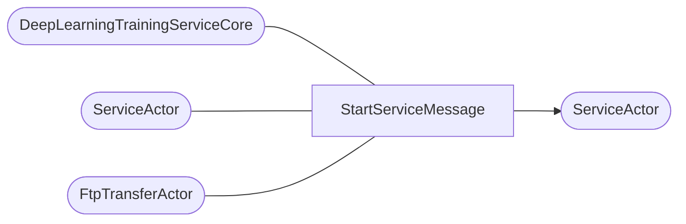
- Sender
  - [Mirero.IRIS.Akka.DeepLearning.Training.Service.DeepLearningTrainingServiceCore](#mireroirisakkadeeplearningtrainingservicedeeplearningtrainingservicecore) (2)
     - C:\Workspace\iris_review\Mirero.IRIS.Akka.Service\Mirero.IRIS.Akka.DeepLearning.Training.Service\DeepLearningTrainingServiceCore.cs#L46
     - C:\Workspace\iris_review\Mirero.IRIS.Akka.Service\Mirero.IRIS.Akka.DeepLearning.Training.Service\DeepLearningTrainingServiceCore.cs#L58
  - [Mirero.IRIS.Akka.DeepLearning.Training.Service.DeepLearningTrainingServiceCore](#mireroirisakkadeeplearningtrainingservicedeeplearningtrainingservicecore) (2)
     - C:\Workspace\iris_review\Mirero.IRIS.Akka.Service\Mirero.IRIS.Akka.DeepLearning.Training.Service\DeepLearningTrainingServiceCore.cs#L46
     - C:\Workspace\iris_review\Mirero.IRIS.Akka.Service\Mirero.IRIS.Akka.DeepLearning.Training.Service\DeepLearningTrainingServiceCore.cs#L58
  - [Mirero.IRIS.Akka.DeepLearning.Training.Service.Actor.Service.ServiceActor](#mireroirisakkadeeplearningtrainingserviceactorserviceserviceactor) (1)
     - C:\Workspace\iris_review\Mirero.IRIS.Akka.Service\Mirero.IRIS.Akka.DeepLearning.Training.Service\Actor\Service\ServiceActor.cs#L111
  - [Mirero.IRIS.Akka.DeepLearning.Training.Service.Actor.FtpTransfer.FtpTransferActor](#mireroirisakkadeeplearningtrainingserviceactorftptransferftptransferactor) (1)
     - C:\Workspace\iris_review\Mirero.IRIS.Akka.Service\Mirero.IRIS.Akka.DeepLearning.Training.Service\Actor\FtpTransfer\FtpTransferActor.cs#L46
- Receiver
  - [Mirero.IRIS.Akka.DeepLearning.Training.Service.Actor.Service.ServiceActor](#mireroirisakkadeeplearningtrainingserviceactorserviceserviceactor) (1)

## Mirero.IRIS.Akka.DeepLearning.Training.Service.Actor.Service.StopServiceMessage
```mermaid
graph LR
linkStyle default interpolate basis
  A0([DeepLearningTrainingServiceCore]) --- B[StopServiceMessage]
  A1([ServiceActor]) --- B[StopServiceMessage]
  B[StopServiceMessage] --> C0([ServiceActor])
```
- Sender
  - [Mirero.IRIS.Akka.DeepLearning.Training.Service.DeepLearningTrainingServiceCore](#mireroirisakkadeeplearningtrainingservicedeeplearningtrainingservicecore) (1)
     - C:\Workspace\iris_review\Mirero.IRIS.Akka.Service\Mirero.IRIS.Akka.DeepLearning.Training.Service\DeepLearningTrainingServiceCore.cs#L52
  - [Mirero.IRIS.Akka.DeepLearning.Training.Service.Actor.Service.ServiceActor](#mireroirisakkadeeplearningtrainingserviceactorserviceserviceactor) (1)
     - C:\Workspace\iris_review\Mirero.IRIS.Akka.Service\Mirero.IRIS.Akka.DeepLearning.Training.Service\Actor\Service\ServiceActor.cs#L141
- Receiver
  - [Mirero.IRIS.Akka.DeepLearning.Training.Service.Actor.Service.ServiceActor](#mireroirisakkadeeplearningtrainingserviceactorserviceserviceactor) (1)

## Mirero.IRIS.Akka.DeepLearning.Training.Service.Actor.FileCreator.StartFileCreateMessage
```mermaid
graph LR
linkStyle default interpolate basis
  A0([LtImageCreateActor]) --- B[StartFileCreateMessage]
  A1([AtiImageCreateActor]) --- B[StartFileCreateMessage]
  A2([KlaImageCreateActor]) --- B[StartFileCreateMessage]
  B[StartFileCreateMessage] --> C0([FileCreateActor])
```
- Sender
  - [Mirero.IRIS.Akka.DeepLearning.Training.Service.Actor.LtImageCreator.LtImageCreateActor](#mireroirisakkadeeplearningtrainingserviceactorltimagecreatorltimagecreateactor) (1)
     - C:\Workspace\iris_review\Mirero.IRIS.Akka.Service\Mirero.IRIS.Akka.DeepLearning.Training.Service\Actor\LtImageCreator\LtImageCreateActor.cs#L35
  - [Mirero.IRIS.Akka.DeepLearning.Training.Service.Actor.AtiImageCreator.AtiImageCreateActor](#mireroirisakkadeeplearningtrainingserviceactoratiimagecreatoratiimagecreateactor) (1)
     - C:\Workspace\iris_review\Mirero.IRIS.Akka.Service\Mirero.IRIS.Akka.DeepLearning.Training.Service\Actor\AtiImageCreator\AtiImageCreateActor.cs#L38
  - [Mirero.IRIS.Akka.DeepLearning.Training.Service.Actor.KlaImageCreator.KlaImageCreateActor](#mireroirisakkadeeplearningtrainingserviceactorklaimagecreatorklaimagecreateactor) (1)
     - C:\Workspace\iris_review\Mirero.IRIS.Akka.Service\Mirero.IRIS.Akka.DeepLearning.Training.Service\Actor\KlaImageCreator\KlaImageCreateActor.cs#L40
- Receiver
  - [Mirero.IRIS.Akka.DeepLearning.Training.Service.Actor.FileCreator.FileCreateActor](#mireroirisakkadeeplearningtrainingserviceactorfilecreatorfilecreateactor) (1)

## Mirero.IRIS.Akka.DeepLearning.Training.Service.Actor.Service.FailServiceMessage
```mermaid
graph LR
linkStyle default interpolate basis
  A0([LtImageCreateActor]) --- B[FailServiceMessage]
  A1([LearningDataSelectActor]) --- B[FailServiceMessage]
  A2([ImageSeparateActor]) --- B[FailServiceMessage]
  A3([AtiImageCreateActor]) --- B[FailServiceMessage]
  A4([ImageDownLoadActor]) --- B[FailServiceMessage]
  A5([FtpTransferActor]) --- B[FailServiceMessage]
  A6([KlaImageCreateActor]) --- B[FailServiceMessage]
  A7([FileCreateActor]) --- B[FailServiceMessage]
  B[FailServiceMessage] --> C0([ServiceActor])
```
- Sender
  - [Mirero.IRIS.Akka.DeepLearning.Training.Service.Actor.LtImageCreator.LtImageCreateActor](#mireroirisakkadeeplearningtrainingserviceactorltimagecreatorltimagecreateactor) (1)
     - C:\Workspace\iris_review\Mirero.IRIS.Akka.Service\Mirero.IRIS.Akka.DeepLearning.Training.Service\Actor\LtImageCreator\LtImageCreateActor.cs#L52
  - [Mirero.IRIS.Akka.DeepLearning.Training.Service.Actor.LearningDataSelector.LearningDataSelectActor](#mireroirisakkadeeplearningtrainingserviceactorlearningdataselectorlearningdataselectactor) (1)
     - C:\Workspace\iris_review\Mirero.IRIS.Akka.Service\Mirero.IRIS.Akka.DeepLearning.Training.Service\Actor\LearningDataSelector\LearningDataSelectActor.cs#L42
  - [Mirero.IRIS.Akka.DeepLearning.Training.Service.Actor.ImageSeparater.ImageSeparateActor](#mireroirisakkadeeplearningtrainingserviceactorimageseparaterimageseparateactor) (1)
     - C:\Workspace\iris_review\Mirero.IRIS.Akka.Service\Mirero.IRIS.Akka.DeepLearning.Training.Service\Actor\ImageSeparater\ImageSeparateActor.cs#L66
  - [Mirero.IRIS.Akka.DeepLearning.Training.Service.Actor.AtiImageCreator.AtiImageCreateActor](#mireroirisakkadeeplearningtrainingserviceactoratiimagecreatoratiimagecreateactor) (1)
     - C:\Workspace\iris_review\Mirero.IRIS.Akka.Service\Mirero.IRIS.Akka.DeepLearning.Training.Service\Actor\AtiImageCreator\AtiImageCreateActor.cs#L55
  - [Mirero.IRIS.Akka.DeepLearning.Training.Service.Actor.ImageDownLoader.ImageDownLoadActor](#mireroirisakkadeeplearningtrainingserviceactorimagedownloaderimagedownloadactor) (1)
     - C:\Workspace\iris_review\Mirero.IRIS.Akka.Service\Mirero.IRIS.Akka.DeepLearning.Training.Service\Actor\ImageDownLoader\ImageDownLoadActor.cs#L64
  - [Mirero.IRIS.Akka.DeepLearning.Training.Service.Actor.FtpTransfer.FtpTransferActor](#mireroirisakkadeeplearningtrainingserviceactorftptransferftptransferactor) (1)
     - C:\Workspace\iris_review\Mirero.IRIS.Akka.Service\Mirero.IRIS.Akka.DeepLearning.Training.Service\Actor\FtpTransfer\FtpTransferActor.cs#L64
  - [Mirero.IRIS.Akka.DeepLearning.Training.Service.Actor.KlaImageCreator.KlaImageCreateActor](#mireroirisakkadeeplearningtrainingserviceactorklaimagecreatorklaimagecreateactor) (1)
     - C:\Workspace\iris_review\Mirero.IRIS.Akka.Service\Mirero.IRIS.Akka.DeepLearning.Training.Service\Actor\KlaImageCreator\KlaImageCreateActor.cs#L57
  - [Mirero.IRIS.Akka.DeepLearning.Training.Service.Actor.FileCreator.FileCreateActor](#mireroirisakkadeeplearningtrainingserviceactorfilecreatorfilecreateactor) (1)
     - C:\Workspace\iris_review\Mirero.IRIS.Akka.Service\Mirero.IRIS.Akka.DeepLearning.Training.Service\Actor\FileCreator\FileCreateActor.cs#L58
- Receiver
  - [Mirero.IRIS.Akka.DeepLearning.Training.Service.Actor.Service.ServiceActor](#mireroirisakkadeeplearningtrainingserviceactorserviceserviceactor) (1)

## Mirero.IRIS.Akka.DeepLearning.Training.Service.Actor.ImageDownLoader.StartImageDownLoadMessage
```mermaid
graph LR
linkStyle default interpolate basis
  A0([LearningDataSelectActor]) --- B[StartImageDownLoadMessage]
  B[StartImageDownLoadMessage] --> C0([ImageDownLoadActor])
```
- Sender
  - [Mirero.IRIS.Akka.DeepLearning.Training.Service.Actor.LearningDataSelector.LearningDataSelectActor](#mireroirisakkadeeplearningtrainingserviceactorlearningdataselectorlearningdataselectactor) (1)
     - C:\Workspace\iris_review\Mirero.IRIS.Akka.Service\Mirero.IRIS.Akka.DeepLearning.Training.Service\Actor\LearningDataSelector\LearningDataSelectActor.cs#L37
- Receiver
  - [Mirero.IRIS.Akka.DeepLearning.Training.Service.Actor.ImageDownLoader.ImageDownLoadActor](#mireroirisakkadeeplearningtrainingserviceactorimagedownloaderimagedownloadactor) (1)

## Mirero.IRIS.Akka.DeepLearning.Training.Service.Actor.LearningDataSelector.StartLearningDataSelectMessage
```mermaid
graph LR
linkStyle default interpolate basis
  A0([ServiceActor]) --- B[StartLearningDataSelectMessage]
  B[StartLearningDataSelectMessage] --> C0([LearningDataSelectActor])
```
- Sender
  - [Mirero.IRIS.Akka.DeepLearning.Training.Service.Actor.Service.ServiceActor](#mireroirisakkadeeplearningtrainingserviceactorserviceserviceactor) (1)
     - C:\Workspace\iris_review\Mirero.IRIS.Akka.Service\Mirero.IRIS.Akka.DeepLearning.Training.Service\Actor\Service\ServiceActor.cs#L93
- Receiver
  - [Mirero.IRIS.Akka.DeepLearning.Training.Service.Actor.LearningDataSelector.LearningDataSelectActor](#mireroirisakkadeeplearningtrainingserviceactorlearningdataselectorlearningdataselectactor) (1)

## Mirero.IRIS.Akka.DeepLearning.Training.Service.Actor.KlaImageCreator.StartKlaImageCreateMessage
```mermaid
graph LR
linkStyle default interpolate basis
  A0([ImageSeparateActor]) --- B[StartKlaImageCreateMessage]
  B[StartKlaImageCreateMessage] --> C0([KlaImageCreateActor])
```
- Sender
  - [Mirero.IRIS.Akka.DeepLearning.Training.Service.Actor.ImageSeparater.ImageSeparateActor](#mireroirisakkadeeplearningtrainingserviceactorimageseparaterimageseparateactor) (1)
     - C:\Workspace\iris_review\Mirero.IRIS.Akka.Service\Mirero.IRIS.Akka.DeepLearning.Training.Service\Actor\ImageSeparater\ImageSeparateActor.cs#L45
- Receiver
  - [Mirero.IRIS.Akka.DeepLearning.Training.Service.Actor.KlaImageCreator.KlaImageCreateActor](#mireroirisakkadeeplearningtrainingserviceactorklaimagecreatorklaimagecreateactor) (1)

## Mirero.IRIS.Akka.DeepLearning.Training.Service.Actor.LtImageCreator.StartLtImageCreateMessage
```mermaid
graph LR
linkStyle default interpolate basis
  A0([ImageSeparateActor]) --- B[StartLtImageCreateMessage]
  B[StartLtImageCreateMessage] --> C0([LtImageCreateActor])
```
- Sender
  - [Mirero.IRIS.Akka.DeepLearning.Training.Service.Actor.ImageSeparater.ImageSeparateActor](#mireroirisakkadeeplearningtrainingserviceactorimageseparaterimageseparateactor) (1)
     - C:\Workspace\iris_review\Mirero.IRIS.Akka.Service\Mirero.IRIS.Akka.DeepLearning.Training.Service\Actor\ImageSeparater\ImageSeparateActor.cs#L47
- Receiver
  - [Mirero.IRIS.Akka.DeepLearning.Training.Service.Actor.LtImageCreator.LtImageCreateActor](#mireroirisakkadeeplearningtrainingserviceactorltimagecreatorltimagecreateactor) (1)

## Mirero.IRIS.Akka.DeepLearning.Training.Service.Actor.AtiImageCreator.StartAtiImageCreateMessage
```mermaid
graph LR
linkStyle default interpolate basis
  A0([ImageSeparateActor]) --- B[StartAtiImageCreateMessage]
  B[StartAtiImageCreateMessage] --> C0([AtiImageCreateActor])
```
- Sender
  - [Mirero.IRIS.Akka.DeepLearning.Training.Service.Actor.ImageSeparater.ImageSeparateActor](#mireroirisakkadeeplearningtrainingserviceactorimageseparaterimageseparateactor) (1)
     - C:\Workspace\iris_review\Mirero.IRIS.Akka.Service\Mirero.IRIS.Akka.DeepLearning.Training.Service\Actor\ImageSeparater\ImageSeparateActor.cs#L49
- Receiver
  - [Mirero.IRIS.Akka.DeepLearning.Training.Service.Actor.AtiImageCreator.AtiImageCreateActor](#mireroirisakkadeeplearningtrainingserviceactoratiimagecreatoratiimagecreateactor) (1)

## Mirero.IRIS.Akka.DeepLearning.Training.Service.Actor.ImageSeparater.StartImageSeparateMessage
```mermaid
graph LR
linkStyle default interpolate basis
  A0([ImageDownLoadActor]) --- B[StartImageSeparateMessage]
  B[StartImageSeparateMessage] --> C0([ImageSeparateActor])
```
- Sender
  - [Mirero.IRIS.Akka.DeepLearning.Training.Service.Actor.ImageDownLoader.ImageDownLoadActor](#mireroirisakkadeeplearningtrainingserviceactorimagedownloaderimagedownloadactor) (1)
     - C:\Workspace\iris_review\Mirero.IRIS.Akka.Service\Mirero.IRIS.Akka.DeepLearning.Training.Service\Actor\ImageDownLoader\ImageDownLoadActor.cs#L47
- Receiver
  - [Mirero.IRIS.Akka.DeepLearning.Training.Service.Actor.ImageSeparater.ImageSeparateActor](#mireroirisakkadeeplearningtrainingserviceactorimageseparaterimageseparateactor) (1)

## Mirero.IRIS.Akka.DeepLearning.Training.Service.Actor.FtpTransfer.StartFtpTransferMessage
```mermaid
graph LR
linkStyle default interpolate basis
  A0([FileCreateActor]) --- B[StartFtpTransferMessage]
  B[StartFtpTransferMessage] --> C0([FtpTransferActor])
```
- Sender
  - [Mirero.IRIS.Akka.DeepLearning.Training.Service.Actor.FileCreator.FileCreateActor](#mireroirisakkadeeplearningtrainingserviceactorfilecreatorfilecreateactor) (1)
     - C:\Workspace\iris_review\Mirero.IRIS.Akka.Service\Mirero.IRIS.Akka.DeepLearning.Training.Service\Actor\FileCreator\FileCreateActor.cs#L41
- Receiver
  - [Mirero.IRIS.Akka.DeepLearning.Training.Service.Actor.FtpTransfer.FtpTransferActor](#mireroirisakkadeeplearningtrainingserviceactorftptransferftptransferactor) (1)

## Mirero.IRIS.Akka.Transmitter.Service.Actors.FTPInterface.FTPInterfaceActor.EndDownloadMessage
```mermaid
graph LR
linkStyle default interpolate basis
  A0([FTPDownloadActor]) --- B[EndDownloadMessage]
```
- Sender
  - [Mirero.IRIS.Akka.Transmitter.Service.Actors.FTPDownload.FTPDownloadActor](#mireroirisakkatransmitterserviceactorsftpdownloadftpdownloadactor) (1)
     - C:\Workspace\iris_review\Mirero.IRIS.Service\Mirero.IRIS.Akka.Transmitter.Service\Actors\FTPDownload\FTPDownloadActor.cs#L23

## Mirero.IRIS.Akka.Transmitter.Service.Actors.FTPInterface.FTPInterfaceActor.EndUnZppingAndADCTransferZppingMessage
```mermaid
graph LR
linkStyle default interpolate basis
  A0([ZipActor]) --- B[EndUnZppingAndADCTransferZppingMessage]
```
- Sender
  - [Mirero.IRIS.Akka.Transmitter.Service.Actors.Zip.ZipActor](#mireroirisakkatransmitterserviceactorszipzipactor) (1)
     - C:\Workspace\iris_review\Mirero.IRIS.Service\Mirero.IRIS.Akka.Transmitter.Service\Actors\Zip\ZipActor.cs#L28

## Mirero.IRIS.Akka.Transmitter.Service.Actors.Service.ServiceActor.StartServiceMessage
```mermaid
graph LR
linkStyle default interpolate basis
  A0([TransmitterServiceCore]) --- B[StartServiceMessage]
```
- Sender
  - [Mirero.IRIS.Akka.Transmitter.Service.TransmitterServiceCore](#mireroirisakkatransmitterservicetransmitterservicecore) (2)
     - C:\Workspace\iris_review\Mirero.IRIS.Service\Mirero.IRIS.Akka.Transmitter.Service\TransmitterServiceCore.cs#L50
     - C:\Workspace\iris_review\Mirero.IRIS.Service\Mirero.IRIS.Akka.Transmitter.Service\TransmitterServiceCore.cs#L55
  - [Mirero.IRIS.Akka.Transmitter.Service.TransmitterServiceCore](#mireroirisakkatransmitterservicetransmitterservicecore) (2)
     - C:\Workspace\iris_review\Mirero.IRIS.Service\Mirero.IRIS.Akka.Transmitter.Service\TransmitterServiceCore.cs#L50
     - C:\Workspace\iris_review\Mirero.IRIS.Service\Mirero.IRIS.Akka.Transmitter.Service\TransmitterServiceCore.cs#L55

## Mirero.IRIS.Akka.Transmitter.Service.Actors.Service.ServiceActor.StopServiceMessage
```mermaid
graph LR
linkStyle default interpolate basis
  A0([TransmitterServiceCore]) --- B[StopServiceMessage]
```
- Sender
  - [Mirero.IRIS.Akka.Transmitter.Service.TransmitterServiceCore](#mireroirisakkatransmitterservicetransmitterservicecore) (1)
     - C:\Workspace\iris_review\Mirero.IRIS.Service\Mirero.IRIS.Akka.Transmitter.Service\TransmitterServiceCore.cs#L61

## Mirero.IRIS.Akka.Transmitter.Service.Actors.FTPDownload.FTPDownloadActor.StartDownloadMessage
```mermaid
graph LR
linkStyle default interpolate basis
  A0([FTPInterfaceActor]) --- B[StartDownloadMessage]
```
- Sender
  - [Mirero.IRIS.Akka.Transmitter.Service.Actors.FTPInterface.FTPInterfaceActor](#mireroirisakkatransmitterserviceactorsftpinterfaceftpinterfaceactor) (1)
     - C:\Workspace\iris_review\Mirero.IRIS.Service\Mirero.IRIS.Akka.Transmitter.Service\Actors\FTPInterface\FTPInterfaceActor.cs#L36

## Mirero.IRIS.Akka.Transmitter.Service.Actors.Zip.ZipActor.StartUnZippingMessage
```mermaid
graph LR
linkStyle default interpolate basis
  A0([FTPInterfaceActor]) --- B[StartUnZippingMessage]
  B[StartUnZippingMessage] --> C0([ZipActor])
```
- Sender
  - [Mirero.IRIS.Akka.Transmitter.Service.Actors.FTPInterface.FTPInterfaceActor](#mireroirisakkatransmitterserviceactorsftpinterfaceftpinterfaceactor) (1)
     - C:\Workspace\iris_review\Mirero.IRIS.Service\Mirero.IRIS.Akka.Transmitter.Service\Actors\FTPInterface\FTPInterfaceActor.cs#L44
- Receiver
  - [Mirero.IRIS.Akka.Transmitter.Service.Actors.Zip.ZipActor](#mireroirisakkatransmitterserviceactorszipzipactor) (1)

## Mirero.IRIS.Akka.Transmitter.Service.Actors.GenerateSMF.GenerateSMFActor.StartGenerateSMFMessage
```mermaid
graph LR
linkStyle default interpolate basis
  A0([FTPInterfaceActor]) --- B[StartGenerateSMFMessage]
  B[StartGenerateSMFMessage] --> C0([GenerateSMFActor])
```
- Sender
  - [Mirero.IRIS.Akka.Transmitter.Service.Actors.FTPInterface.FTPInterfaceActor](#mireroirisakkatransmitterserviceactorsftpinterfaceftpinterfaceactor) (1)
     - C:\Workspace\iris_review\Mirero.IRIS.Service\Mirero.IRIS.Akka.Transmitter.Service\Actors\FTPInterface\FTPInterfaceActor.cs#L45
- Receiver
  - [Mirero.IRIS.Akka.Transmitter.Service.Actors.GenerateSMF.GenerateSMFActor](#mireroirisakkatransmitterserviceactorsgeneratesmfgeneratesmfactor) (1)

## Mirero.IRIS.Akka.Transmitter.Service.Actors.FTPUpload.FTPUploadActor.StartUploadMessage
```mermaid
graph LR
linkStyle default interpolate basis
  A0([FTPInterfaceActor]) --- B[StartUploadMessage]
```
- Sender
  - [Mirero.IRIS.Akka.Transmitter.Service.Actors.FTPInterface.FTPInterfaceActor](#mireroirisakkatransmitterserviceactorsftpinterfaceftpinterfaceactor) (1)
     - C:\Workspace\iris_review\Mirero.IRIS.Service\Mirero.IRIS.Akka.Transmitter.Service\Actors\FTPInterface\FTPInterfaceActor.cs#L85

## Mirero.IRIS.Akka.Transmitter.Service.Actors.DBInterface.DBInterfaceActor.StartJobMessage
```mermaid
graph LR
linkStyle default interpolate basis
  A0([ServiceActor]) --- B[StartJobMessage]
```
- Sender
  - [Mirero.IRIS.Akka.Transmitter.Service.Actors.Service.ServiceActor](#mireroirisakkatransmitterserviceactorsserviceserviceactor) (2)
     - C:\Workspace\iris_review\Mirero.IRIS.Service\Mirero.IRIS.Akka.Transmitter.Service\Actors\Service\ServiceActor.cs#L29
     - C:\Workspace\iris_review\Mirero.IRIS.Service\Mirero.IRIS.Akka.Transmitter.Service\Actors\Service\ServiceActor.cs#L55
  - [Mirero.IRIS.Akka.Transmitter.Service.Actors.Service.ServiceActor](#mireroirisakkatransmitterserviceactorsserviceserviceactor) (2)
     - C:\Workspace\iris_review\Mirero.IRIS.Service\Mirero.IRIS.Akka.Transmitter.Service\Actors\Service\ServiceActor.cs#L29
     - C:\Workspace\iris_review\Mirero.IRIS.Service\Mirero.IRIS.Akka.Transmitter.Service\Actors\Service\ServiceActor.cs#L55

## Mirero.IRIS.Akka.Transmitter.Service.Actors.DBQuery.DBQueryActor.RequestTargetDataMessage
```mermaid
graph LR
linkStyle default interpolate basis
  A0([DBInterfaceActor]) --- B[RequestTargetDataMessage]
```
- Sender
  - [Mirero.IRIS.Akka.Transmitter.Service.Actors.DBInterface.DBInterfaceActor](#mireroirisakkatransmitterserviceactorsdbinterfacedbinterfaceactor) (1)
     - C:\Workspace\iris_review\Mirero.IRIS.Service\Mirero.IRIS.Akka.Transmitter.Service\Actors\DBInterface\DBInterfaceActor.cs#L28

## Mirero.IRIS.Akka.Transmitter.Service.Actors.FTPInterface.FTPInterfaceActor.StartDownloadMessage
```mermaid
graph LR
linkStyle default interpolate basis
  A0([DBInterfaceActor]) --- B[StartDownloadMessage]
```
- Sender
  - [Mirero.IRIS.Akka.Transmitter.Service.Actors.DBInterface.DBInterfaceActor](#mireroirisakkatransmitterserviceactorsdbinterfacedbinterfaceactor) (1)
     - C:\Workspace\iris_review\Mirero.IRIS.Service\Mirero.IRIS.Akka.Transmitter.Service\Actors\DBInterface\DBInterfaceActor.cs#L35

## Mirero.IRIS.Akka.Transmitter.Service.Actors.DBQuery.DBQueryActor.RequestMaskDataMessage
```mermaid
graph LR
linkStyle default interpolate basis
  A0([DBInterfaceActor]) --- B[RequestMaskDataMessage]
```
- Sender
  - [Mirero.IRIS.Akka.Transmitter.Service.Actors.DBInterface.DBInterfaceActor](#mireroirisakkatransmitterserviceactorsdbinterfacedbinterfaceactor) (1)
     - C:\Workspace\iris_review\Mirero.IRIS.Service\Mirero.IRIS.Akka.Transmitter.Service\Actors\DBInterface\DBInterfaceActor.cs#L42

## Mirero.IRIS.Akka.Transmitter.Service.Actors.GenerateSMF.GenerateSMFActor.ReplyMaskDataMessage
```mermaid
graph LR
linkStyle default interpolate basis
  A0([DBInterfaceActor]) --- B[ReplyMaskDataMessage]
  B[ReplyMaskDataMessage] --> C0([GenerateSMFActor])
```
- Sender
  - [Mirero.IRIS.Akka.Transmitter.Service.Actors.DBInterface.DBInterfaceActor](#mireroirisakkatransmitterserviceactorsdbinterfacedbinterfaceactor) (1)
     - C:\Workspace\iris_review\Mirero.IRIS.Service\Mirero.IRIS.Akka.Transmitter.Service\Actors\DBInterface\DBInterfaceActor.cs#L47
- Receiver
  - [Mirero.IRIS.Akka.Transmitter.Service.Actors.GenerateSMF.GenerateSMFActor](#mireroirisakkatransmitterserviceactorsgeneratesmfgeneratesmfactor) (1)

# 2. Actors
## Mirero.IRIS.Akka.InspectionLoader.Service.Actors.ATIDataCollector.ATIDataCollectorActor
```mermaid
graph LR
linkStyle default interpolate basis
  A0[StartATIDataCollectorMessage] --> B((ATIDataCollectorActor))
  B((ATIDataCollectorActor)) --> C0[StartATIParsingMessage]
click A0 "#mireroirisakkainspectionloaderserviceactorsatidatacollectorstartatidatacollectormessage"
click C0 "#mireroirisakkainspectionloaderserviceactorsatiparserstartatiparsingmessage"

```
- Send Messages
  - [Mirero.IRIS.Akka.InspectionLoader.Service.Actors.ATIParser.StartATIParsingMessage](#mireroirisakkainspectionloaderserviceactorsatiparserstartatiparsingmessage) (0)
     - C:\Workspace\iris_review\Mirero.IRIS.Akka.Service\Mirero.IRIS.Akka.InspectionLoader.Service\Actors\ATIDataCollector\ATIDataCollectorActor.cs#L38
- Receive Messages
  - [Mirero.IRIS.Akka.InspectionLoader.Service.Actors.ATIDataCollector.StartATIDataCollectorMessage](#mireroirisakkainspectionloaderserviceactorsatidatacollectorstartatidatacollectormessage) (1)

## Mirero.IRIS.Akka.InspectionLoader.Service.Actors.DemounterDataCollector.DemounterDataCollectorActor
```mermaid
graph LR
linkStyle default interpolate basis
  A0[StartDemounterDataCollectorMessage] --> B((DemounterDataCollectorActor))
  B((DemounterDataCollectorActor)) --> C0[StartDemounterParserMessage]
click A0 "#mireroirisakkainspectionloaderserviceactorsdemounterdatacollectorstartdemounterdatacollectormessage"
click C0 "#mireroirisakkainspectionloaderserviceactorsdemounterparserstartdemounterparsermessage"

```
- Send Messages
  - [Mirero.IRIS.Akka.InspectionLoader.Service.Actors.DemounterParser.StartDemounterParserMessage](#mireroirisakkainspectionloaderserviceactorsdemounterparserstartdemounterparsermessage) (0)
     - C:\Workspace\iris_review\Mirero.IRIS.Akka.Service\Mirero.IRIS.Akka.InspectionLoader.Service\Actors\DemounterDataCollector\DemounterDataCollector.cs#L33
- Receive Messages
  - [Mirero.IRIS.Akka.InspectionLoader.Service.Actors.DemounterDataCollector.StartDemounterDataCollectorMessage](#mireroirisakkainspectionloaderserviceactorsdemounterdatacollectorstartdemounterdatacollectormessage) (1)

## Mirero.IRIS.Akka.InspectionLoader.Service.InspectionLoaderServiceCore
```mermaid
graph LR
linkStyle default interpolate basis
  A0[StopServiceMessage] --> B((InspectionLoaderServiceCore))
  A1[StartServiceMessage] --> B((InspectionLoaderServiceCore))
  B((InspectionLoaderServiceCore)) --> C0[StartServiceMessage]
click A0 "#mireroirisakkainspectionloaderserviceactorsservicestopservicemessage"
click A1 "#mireroirisakkainspectionloaderserviceactorsservicestartservicemessage"
click C0 "#mireroirisakkainspectionloaderserviceactorsservicestartservicemessage"

```
- Send Messages
  - [Mirero.IRIS.Akka.InspectionLoader.Service.Actors.Service.StartServiceMessage](#mireroirisakkainspectionloaderserviceactorsservicestartservicemessage) (0)
     - C:\Workspace\iris_review\Mirero.IRIS.Akka.Service\Mirero.IRIS.Akka.InspectionLoader.Service\InspectionLoaderServiceCore.cs#L45
- Receive Messages
  - [Mirero.IRIS.Akka.InspectionLoader.Service.Actors.Service.StopServiceMessage](#mireroirisakkainspectionloaderserviceactorsservicestopservicemessage) (1)
  - [Mirero.IRIS.Akka.InspectionLoader.Service.Actors.Service.StartServiceMessage](#mireroirisakkainspectionloaderserviceactorsservicestartservicemessage) (1)

## Mirero.IRIS.Akka.InspectionLoader.Service.Actors.DemounterParser.DemounterParserActor
```mermaid
graph LR
linkStyle default interpolate basis
  A0[StartDemounterParserMessage] --> B((DemounterParserActor))
  B((DemounterParserActor)) --> C0[StartDemounterFtpCollectorMessage]
click A0 "#mireroirisakkainspectionloaderserviceactorsdemounterparserstartdemounterparsermessage"
click C0 "#mireroirisakkainspectionloaderserviceactorsdemounterftpcollectorstartdemounterftpcollectormessage"

```
- Send Messages
  - [Mirero.IRIS.Akka.InspectionLoader.Service.Actors.DemounterFtpCollector.StartDemounterFtpCollectorMessage](#mireroirisakkainspectionloaderserviceactorsdemounterftpcollectorstartdemounterftpcollectormessage) (0)
     - C:\Workspace\iris_review\Mirero.IRIS.Akka.Service\Mirero.IRIS.Akka.InspectionLoader.Service\Actors\DemounterParser\DemounterParserActor.cs#L43
- Receive Messages
  - [Mirero.IRIS.Akka.InspectionLoader.Service.Actors.DemounterParser.StartDemounterParserMessage](#mireroirisakkainspectionloaderserviceactorsdemounterparserstartdemounterparsermessage) (1)

## Mirero.IRIS.Akka.InspectionLoader.Service.Actors.Service.ServiceActor
```mermaid
graph LR
linkStyle default interpolate basis
  A0[StartServiceMessage] --> B((ServiceActor))
  A1[StopServiceMessage] --> B((ServiceActor))
  B((ServiceActor)) --> C0[StartStockerDataCollectorMessage]
click A0 "#mireroirisakkainspectionloaderserviceactorsservicestartservicemessage"
click A1 "#mireroirisakkainspectionloaderserviceactorsservicestopservicemessage"
click C0 "#mireroirisakkainspectionloaderserviceactorsstockerdatacollectorstockerdatacollectoractorstartstockerdatacollectormessage"

```
- Send Messages
  - [Mirero.IRIS.Akka.InspectionLoader.Service.Actors.StockerDataCollector.StockerDataCollectorActor.StartStockerDataCollectorMessage](#mireroirisakkainspectionloaderserviceactorsstockerdatacollectorstockerdatacollectoractorstartstockerdatacollectormessage) (0)
     - C:\Workspace\iris_review\Mirero.IRIS.Akka.Service\Mirero.IRIS.Akka.InspectionLoader.Service\Actors\Service\ServiceActor.cs#L123
- Receive Messages
  - [Mirero.IRIS.Akka.InspectionLoader.Service.Actors.Service.StartServiceMessage](#mireroirisakkainspectionloaderserviceactorsservicestartservicemessage) (2)
  - [Mirero.IRIS.Akka.InspectionLoader.Service.Actors.Service.StopServiceMessage](#mireroirisakkainspectionloaderserviceactorsservicestopservicemessage) (1)

## Mirero.IRIS.Akka.InspectionLoader.Service.Actors.StockerDataCollector.StockerDataCollectorActor
```mermaid
graph LR
linkStyle default interpolate basis
  A0[StartStockerDataCollectorMessage] --> B((StockerDataCollectorActor))
  A1[StartStockerPasingMessage] --> B((StockerDataCollectorActor))
  B((StockerDataCollectorActor)) --> C0[StartStockerDataCollectorMessage]
click A0 "#mireroirisakkainspectionloaderserviceactorsstockerdatacollectorstockerdatacollectoractorstartstockerdatacollectormessage"
click A1 "#mireroirisakkainspectionloaderserviceactorsstockerparserstockerparseractorstartstockerpasingmessage"
click C0 "#mireroirisakkainspectionloaderserviceactorsstockerdatacollectorstockerdatacollectoractorstartstockerdatacollectormessage"

```
- Send Messages
  - [Mirero.IRIS.Akka.InspectionLoader.Service.Actors.StockerDataCollector.StockerDataCollectorActor.StartStockerDataCollectorMessage](#mireroirisakkainspectionloaderserviceactorsstockerdatacollectorstockerdatacollectoractorstartstockerdatacollectormessage) (0)
     - C:\Workspace\iris_review\Mirero.IRIS.Akka.Service\Mirero.IRIS.Akka.InspectionLoader.Service\Actors\StockerDataCollector\StockerDataCollectorActor.cs#L45
- Receive Messages
  - [Mirero.IRIS.Akka.InspectionLoader.Service.Actors.StockerDataCollector.StockerDataCollectorActor.StartStockerDataCollectorMessage](#mireroirisakkainspectionloaderserviceactorsstockerdatacollectorstockerdatacollectoractorstartstockerdatacollectormessage) (2)
  - [Mirero.IRIS.Akka.InspectionLoader.Service.Actors.StockerParser.StockerParserActor.StartStockerPasingMessage](#mireroirisakkainspectionloaderserviceactorsstockerparserstockerparseractorstartstockerpasingmessage) (1)

## Mirero.IRIS.Akka.InspectionLoader.Service.Actors.SmfParser.SmfParserActor
```mermaid
graph LR
linkStyle default interpolate basis
  A0[StartSmfParsingMessage] --> B((SmfParserActor))
  B((SmfParserActor)) --> C0[StartATIFtpCollectorMessage]
click A0 "#mireroirisakkainspectionloaderserviceactorssmfparserstartsmfparsingmessage"
click C0 "#mireroirisakkainspectionloaderserviceactorsatiftpcollectorstartatiftpcollectormessage"

```
- Send Messages
  - [Mirero.IRIS.Akka.InspectionLoader.Service.Actors.ATIFtpCollector.StartATIFtpCollectorMessage](#mireroirisakkainspectionloaderserviceactorsatiftpcollectorstartatiftpcollectormessage) (0)
     - C:\Workspace\iris_review\Mirero.IRIS.Akka.Service\Mirero.IRIS.Akka.InspectionLoader.Service\Actors\SmfParser\SmfParserActor.cs#L43
- Receive Messages
  - [Mirero.IRIS.Akka.InspectionLoader.Service.Actors.SmfParser.StartSmfParsingMessage](#mireroirisakkainspectionloaderserviceactorssmfparserstartsmfparsingmessage) (1)

## Mirero.IRIS.Akka.InspectionLoader.Service.Actors.ATIParser.ATIParserActor
```mermaid
graph LR
linkStyle default interpolate basis
  A0[StartATIParsingMessage] --> B((ATIParserActor))
  B((ATIParserActor)) --> C0[StartATIFtpCollectorMessage]
click A0 "#mireroirisakkainspectionloaderserviceactorsatiparserstartatiparsingmessage"
click C0 "#mireroirisakkainspectionloaderserviceactorsatiftpcollectorstartatiftpcollectormessage"

```
- Send Messages
  - [Mirero.IRIS.Akka.InspectionLoader.Service.Actors.ATIFtpCollector.StartATIFtpCollectorMessage](#mireroirisakkainspectionloaderserviceactorsatiftpcollectorstartatiftpcollectormessage) (0)
     - C:\Workspace\iris_review\Mirero.IRIS.Akka.Service\Mirero.IRIS.Akka.InspectionLoader.Service\Actors\ATIParser\ATIParserActor.cs#L50
- Receive Messages
  - [Mirero.IRIS.Akka.InspectionLoader.Service.Actors.ATIParser.StartATIParsingMessage](#mireroirisakkainspectionloaderserviceactorsatiparserstartatiparsingmessage) (1)

## Mirero.IRIS.Akka.InspectionLoader.Service.Actors.StockerParser.StockerParserActor
```mermaid
graph LR
linkStyle default interpolate basis
  A0[StartStockerPasingMessage] --> B((StockerParserActor))
  B((StockerParserActor)) --> C0[StockerTransfer]
click A0 "#mireroirisakkainspectionloaderserviceactorsstockerparserstockerparseractorstartstockerpasingmessage"
click C0 "#mireroirisakkainspectionloaderserviceactorstransferdataftptransferactorstockertransfer"

```
- Send Messages
  - [Mirero.IRIS.Akka.InspectionLoader.Service.Actors.TransferData.FTPTransferActor.StockerTransfer](#mireroirisakkainspectionloaderserviceactorstransferdataftptransferactorstockertransfer) (0)
     - C:\Workspace\iris_review\Mirero.IRIS.Akka.Service\Mirero.IRIS.Akka.InspectionLoader.Service\Actors\StockerParser\StockerParserActor.cs#L60
- Receive Messages
  - [Mirero.IRIS.Akka.InspectionLoader.Service.Actors.StockerParser.StockerParserActor.StartStockerPasingMessage](#mireroirisakkainspectionloaderserviceactorsstockerparserstockerparseractorstartstockerpasingmessage) (1)

## Mirero.IRIS.Akka.InspectionLoader.Service.Actors.TransferData.FTPTransferActor
```mermaid
graph LR
linkStyle default interpolate basis
  A0[DemounterSaveDB] --> B((FTPTransferActor))
  A1[StockerSaveDB] --> B((FTPTransferActor))
  A2[AtiTransfer] --> B((FTPTransferActor))
  A3[DemounterTransfer] --> B((FTPTransferActor))
  A4[StockerTransfer] --> B((FTPTransferActor))
  B((FTPTransferActor)) --> C0[AtiSaveDB]
click A0 "#mireroirisakkainspectionloaderserviceactorssavedbsavedbactordemountersavedb"
click A1 "#mireroirisakkainspectionloaderserviceactorssavedbsavedbactorstockersavedb"
click A2 "#mireroirisakkainspectionloaderserviceactorstransferdataftptransferactoratitransfer"
click A3 "#mireroirisakkainspectionloaderserviceactorstransferdataftptransferactordemountertransfer"
click A4 "#mireroirisakkainspectionloaderserviceactorstransferdataftptransferactorstockertransfer"
click C0 "#mireroirisakkainspectionloaderserviceactorssavedbsavedbactoratisavedb"

```
- Send Messages
  - [Mirero.IRIS.Akka.InspectionLoader.Service.Actors.SaveDB.SaveDBActor.AtiSaveDB](#mireroirisakkainspectionloaderserviceactorssavedbsavedbactoratisavedb) (0)
     - C:\Workspace\iris_review\Mirero.IRIS.Akka.Service\Mirero.IRIS.Akka.InspectionLoader.Service\Actors\TransferData\FTPTransferActor.cs#L117
- Receive Messages
  - [Mirero.IRIS.Akka.InspectionLoader.Service.Actors.SaveDB.SaveDBActor.DemounterSaveDB](#mireroirisakkainspectionloaderserviceactorssavedbsavedbactordemountersavedb) (1)
  - [Mirero.IRIS.Akka.InspectionLoader.Service.Actors.SaveDB.SaveDBActor.StockerSaveDB](#mireroirisakkainspectionloaderserviceactorssavedbsavedbactorstockersavedb) (1)
  - [Mirero.IRIS.Akka.InspectionLoader.Service.Actors.TransferData.FTPTransferActor.AtiTransfer](#mireroirisakkainspectionloaderserviceactorstransferdataftptransferactoratitransfer) (1)
  - [Mirero.IRIS.Akka.InspectionLoader.Service.Actors.TransferData.FTPTransferActor.DemounterTransfer](#mireroirisakkainspectionloaderserviceactorstransferdataftptransferactordemountertransfer) (1)
  - [Mirero.IRIS.Akka.InspectionLoader.Service.Actors.TransferData.FTPTransferActor.StockerTransfer](#mireroirisakkainspectionloaderserviceactorstransferdataftptransferactorstockertransfer) (1)

## Mirero.IRIS.Akka.InspectionLoader.Service.Actors.ATIFtpCollector.ATIFtpCollectorActor
```mermaid
graph LR
linkStyle default interpolate basis
  A0[StartATIFtpCollectorMessage] --> B((ATIFtpCollectorActor))
  B((ATIFtpCollectorActor)) --> C0[AtiTransfer]
click A0 "#mireroirisakkainspectionloaderserviceactorsatiftpcollectorstartatiftpcollectormessage"
click C0 "#mireroirisakkainspectionloaderserviceactorstransferdataftptransferactoratitransfer"

```
- Send Messages
  - [Mirero.IRIS.Akka.InspectionLoader.Service.Actors.TransferData.FTPTransferActor.AtiTransfer](#mireroirisakkainspectionloaderserviceactorstransferdataftptransferactoratitransfer) (0)
     - C:\Workspace\iris_review\Mirero.IRIS.Akka.Service\Mirero.IRIS.Akka.InspectionLoader.Service\Actors\ATIFtpCollector\ATIFtpCollectorActor.cs#L68
- Receive Messages
  - [Mirero.IRIS.Akka.InspectionLoader.Service.Actors.ATIFtpCollector.StartATIFtpCollectorMessage](#mireroirisakkainspectionloaderserviceactorsatiftpcollectorstartatiftpcollectormessage) (1)

## Mirero.IRIS.Akka.InspectionLoader.Service.Actors.DemounterFtpCollector.DemounterFtpCollectorActor
```mermaid
graph LR
linkStyle default interpolate basis
  A0[StartDemounterFtpCollectorMessage] --> B((DemounterFtpCollectorActor))
  B((DemounterFtpCollectorActor)) --> C0[DemounterTransfer]
click A0 "#mireroirisakkainspectionloaderserviceactorsdemounterftpcollectorstartdemounterftpcollectormessage"
click C0 "#mireroirisakkainspectionloaderserviceactorstransferdataftptransferactordemountertransfer"

```
- Send Messages
  - [Mirero.IRIS.Akka.InspectionLoader.Service.Actors.TransferData.FTPTransferActor.DemounterTransfer](#mireroirisakkainspectionloaderserviceactorstransferdataftptransferactordemountertransfer) (0)
     - C:\Workspace\iris_review\Mirero.IRIS.Akka.Service\Mirero.IRIS.Akka.InspectionLoader.Service\Actors\DemounterFtpCollector\DemounterFtpCollectorActor.cs#L71
- Receive Messages
  - [Mirero.IRIS.Akka.InspectionLoader.Service.Actors.DemounterFtpCollector.StartDemounterFtpCollectorMessage](#mireroirisakkainspectionloaderserviceactorsdemounterftpcollectorstartdemounterftpcollectormessage) (1)

## Mirero.IRIS.Akka.InspectionLoader.Service.Actors.SmfDataCollector.SmfDataCollectorActor
```mermaid
graph LR
linkStyle default interpolate basis
  A0[StartSmfDataCollectorMessage] --> B((SmfDataCollectorActor))
click A0 "#mireroirisakkainspectionloaderserviceactorssmfdatacollectorstartsmfdatacollectormessage"

```
- Receive Messages
  - [Mirero.IRIS.Akka.InspectionLoader.Service.Actors.SmfDataCollector.StartSmfDataCollectorMessage](#mireroirisakkainspectionloaderserviceactorssmfdatacollectorstartsmfdatacollectormessage) (1)

## Mirero.IRIS.Akka.InspectionLoader.Service.Actors.SaveDB.SaveDBActor
```mermaid
graph LR
linkStyle default interpolate basis
  A0[AtiSaveDB] --> B((SaveDBActor))
  A1[DemounterSaveDB] --> B((SaveDBActor))
  A2[StockerSaveDB] --> B((SaveDBActor))
click A0 "#mireroirisakkainspectionloaderserviceactorssavedbsavedbactoratisavedb"
click A1 "#mireroirisakkainspectionloaderserviceactorssavedbsavedbactordemountersavedb"
click A2 "#mireroirisakkainspectionloaderserviceactorssavedbsavedbactorstockersavedb"

```
- Receive Messages
  - [Mirero.IRIS.Akka.InspectionLoader.Service.Actors.SaveDB.SaveDBActor.AtiSaveDB](#mireroirisakkainspectionloaderserviceactorssavedbsavedbactoratisavedb) (1)
  - [Mirero.IRIS.Akka.InspectionLoader.Service.Actors.SaveDB.SaveDBActor.DemounterSaveDB](#mireroirisakkainspectionloaderserviceactorssavedbsavedbactordemountersavedb) (1)
  - [Mirero.IRIS.Akka.InspectionLoader.Service.Actors.SaveDB.SaveDBActor.StockerSaveDB](#mireroirisakkainspectionloaderserviceactorssavedbsavedbactorstockersavedb) (1)

## Mirero.IRIS.Akka.DeepLearning.Training.Service.DeepLearningTrainingServiceCore
```mermaid
graph LR
linkStyle default interpolate basis
  A0[StopServiceMessage] --> B((DeepLearningTrainingServiceCore))
  A1[StartServiceMessage] --> B((DeepLearningTrainingServiceCore))
  B((DeepLearningTrainingServiceCore)) --> C0[StartServiceMessage]
click A0 "#mireroirisakkadeeplearningtrainingserviceactorservicestopservicemessage"
click A1 "#mireroirisakkadeeplearningtrainingserviceactorservicestartservicemessage"
click C0 "#mireroirisakkadeeplearningtrainingserviceactorservicestartservicemessage"

```
- Send Messages
  - [Mirero.IRIS.Akka.DeepLearning.Training.Service.Actor.Service.StartServiceMessage](#mireroirisakkadeeplearningtrainingserviceactorservicestartservicemessage) (0)
     - C:\Workspace\iris_review\Mirero.IRIS.Akka.Service\Mirero.IRIS.Akka.DeepLearning.Training.Service\DeepLearningTrainingServiceCore.cs#L46
- Receive Messages
  - [Mirero.IRIS.Akka.DeepLearning.Training.Service.Actor.Service.StopServiceMessage](#mireroirisakkadeeplearningtrainingserviceactorservicestopservicemessage) (1)
  - [Mirero.IRIS.Akka.DeepLearning.Training.Service.Actor.Service.StartServiceMessage](#mireroirisakkadeeplearningtrainingserviceactorservicestartservicemessage) (1)

## Mirero.IRIS.Akka.DeepLearning.Training.Service.Actor.LtImageCreator.LtImageCreateActor
```mermaid
graph LR
linkStyle default interpolate basis
  A0[FailServiceMessage] --> B((LtImageCreateActor))
  A1[StartLtImageCreateMessage] --> B((LtImageCreateActor))
  B((LtImageCreateActor)) --> C0[StartFileCreateMessage]
click A0 "#mireroirisakkadeeplearningtrainingserviceactorservicefailservicemessage"
click A1 "#mireroirisakkadeeplearningtrainingserviceactorltimagecreatorstartltimagecreatemessage"
click C0 "#mireroirisakkadeeplearningtrainingserviceactorfilecreatorstartfilecreatemessage"

```
- Send Messages
  - [Mirero.IRIS.Akka.DeepLearning.Training.Service.Actor.FileCreator.StartFileCreateMessage](#mireroirisakkadeeplearningtrainingserviceactorfilecreatorstartfilecreatemessage) (0)
     - C:\Workspace\iris_review\Mirero.IRIS.Akka.Service\Mirero.IRIS.Akka.DeepLearning.Training.Service\Actor\LtImageCreator\LtImageCreateActor.cs#L35
- Receive Messages
  - [Mirero.IRIS.Akka.DeepLearning.Training.Service.Actor.Service.FailServiceMessage](#mireroirisakkadeeplearningtrainingserviceactorservicefailservicemessage) (1)
  - [Mirero.IRIS.Akka.DeepLearning.Training.Service.Actor.LtImageCreator.StartLtImageCreateMessage](#mireroirisakkadeeplearningtrainingserviceactorltimagecreatorstartltimagecreatemessage) (1)

## Mirero.IRIS.Akka.DeepLearning.Training.Service.Actor.LearningDataSelector.LearningDataSelectActor
```mermaid
graph LR
linkStyle default interpolate basis
  A0[FailServiceMessage] --> B((LearningDataSelectActor))
  A1[StartLearningDataSelectMessage] --> B((LearningDataSelectActor))
  B((LearningDataSelectActor)) --> C0[StartImageDownLoadMessage]
click A0 "#mireroirisakkadeeplearningtrainingserviceactorservicefailservicemessage"
click A1 "#mireroirisakkadeeplearningtrainingserviceactorlearningdataselectorstartlearningdataselectmessage"
click C0 "#mireroirisakkadeeplearningtrainingserviceactorimagedownloaderstartimagedownloadmessage"

```
- Send Messages
  - [Mirero.IRIS.Akka.DeepLearning.Training.Service.Actor.ImageDownLoader.StartImageDownLoadMessage](#mireroirisakkadeeplearningtrainingserviceactorimagedownloaderstartimagedownloadmessage) (0)
     - C:\Workspace\iris_review\Mirero.IRIS.Akka.Service\Mirero.IRIS.Akka.DeepLearning.Training.Service\Actor\LearningDataSelector\LearningDataSelectActor.cs#L37
- Receive Messages
  - [Mirero.IRIS.Akka.DeepLearning.Training.Service.Actor.Service.FailServiceMessage](#mireroirisakkadeeplearningtrainingserviceactorservicefailservicemessage) (1)
  - [Mirero.IRIS.Akka.DeepLearning.Training.Service.Actor.LearningDataSelector.StartLearningDataSelectMessage](#mireroirisakkadeeplearningtrainingserviceactorlearningdataselectorstartlearningdataselectmessage) (1)

## Mirero.IRIS.Akka.DeepLearning.Training.Service.Actor.Service.ServiceActor
```mermaid
graph LR
linkStyle default interpolate basis
  A0[StartServiceMessage] --> B((ServiceActor))
  A1[StopServiceMessage] --> B((ServiceActor))
  A2[FailServiceMessage] --> B((ServiceActor))
  B((ServiceActor)) --> C0[StartLearningDataSelectMessage]
click A0 "#mireroirisakkadeeplearningtrainingserviceactorservicestartservicemessage"
click A1 "#mireroirisakkadeeplearningtrainingserviceactorservicestopservicemessage"
click A2 "#mireroirisakkadeeplearningtrainingserviceactorservicefailservicemessage"
click C0 "#mireroirisakkadeeplearningtrainingserviceactorlearningdataselectorstartlearningdataselectmessage"

```
- Send Messages
  - [Mirero.IRIS.Akka.DeepLearning.Training.Service.Actor.LearningDataSelector.StartLearningDataSelectMessage](#mireroirisakkadeeplearningtrainingserviceactorlearningdataselectorstartlearningdataselectmessage) (0)
     - C:\Workspace\iris_review\Mirero.IRIS.Akka.Service\Mirero.IRIS.Akka.DeepLearning.Training.Service\Actor\Service\ServiceActor.cs#L93
- Receive Messages
  - [Mirero.IRIS.Akka.DeepLearning.Training.Service.Actor.Service.StartServiceMessage](#mireroirisakkadeeplearningtrainingserviceactorservicestartservicemessage) (2)
  - [Mirero.IRIS.Akka.DeepLearning.Training.Service.Actor.Service.StopServiceMessage](#mireroirisakkadeeplearningtrainingserviceactorservicestopservicemessage) (2)
  - [Mirero.IRIS.Akka.DeepLearning.Training.Service.Actor.Service.FailServiceMessage](#mireroirisakkadeeplearningtrainingserviceactorservicefailservicemessage) (1)

## Mirero.IRIS.Akka.DeepLearning.Training.Service.Actor.ImageSeparater.ImageSeparateActor
```mermaid
graph LR
linkStyle default interpolate basis
  A0[StartLtImageCreateMessage] --> B((ImageSeparateActor))
  A1[StartAtiImageCreateMessage] --> B((ImageSeparateActor))
  A2[FailServiceMessage] --> B((ImageSeparateActor))
  A3[StartImageSeparateMessage] --> B((ImageSeparateActor))
  B((ImageSeparateActor)) --> C0[StartKlaImageCreateMessage]
click A0 "#mireroirisakkadeeplearningtrainingserviceactorltimagecreatorstartltimagecreatemessage"
click A1 "#mireroirisakkadeeplearningtrainingserviceactoratiimagecreatorstartatiimagecreatemessage"
click A2 "#mireroirisakkadeeplearningtrainingserviceactorservicefailservicemessage"
click A3 "#mireroirisakkadeeplearningtrainingserviceactorimageseparaterstartimageseparatemessage"
click C0 "#mireroirisakkadeeplearningtrainingserviceactorklaimagecreatorstartklaimagecreatemessage"

```
- Send Messages
  - [Mirero.IRIS.Akka.DeepLearning.Training.Service.Actor.KlaImageCreator.StartKlaImageCreateMessage](#mireroirisakkadeeplearningtrainingserviceactorklaimagecreatorstartklaimagecreatemessage) (0)
     - C:\Workspace\iris_review\Mirero.IRIS.Akka.Service\Mirero.IRIS.Akka.DeepLearning.Training.Service\Actor\ImageSeparater\ImageSeparateActor.cs#L45
- Receive Messages
  - [Mirero.IRIS.Akka.DeepLearning.Training.Service.Actor.LtImageCreator.StartLtImageCreateMessage](#mireroirisakkadeeplearningtrainingserviceactorltimagecreatorstartltimagecreatemessage) (1)
  - [Mirero.IRIS.Akka.DeepLearning.Training.Service.Actor.AtiImageCreator.StartAtiImageCreateMessage](#mireroirisakkadeeplearningtrainingserviceactoratiimagecreatorstartatiimagecreatemessage) (1)
  - [Mirero.IRIS.Akka.DeepLearning.Training.Service.Actor.Service.FailServiceMessage](#mireroirisakkadeeplearningtrainingserviceactorservicefailservicemessage) (1)
  - [Mirero.IRIS.Akka.DeepLearning.Training.Service.Actor.ImageSeparater.StartImageSeparateMessage](#mireroirisakkadeeplearningtrainingserviceactorimageseparaterstartimageseparatemessage) (1)

## Mirero.IRIS.Akka.DeepLearning.Training.Service.Actor.AtiImageCreator.AtiImageCreateActor
```mermaid
graph LR
linkStyle default interpolate basis
  A0[FailServiceMessage] --> B((AtiImageCreateActor))
  A1[StartAtiImageCreateMessage] --> B((AtiImageCreateActor))
  B((AtiImageCreateActor)) --> C0[StartFileCreateMessage]
click A0 "#mireroirisakkadeeplearningtrainingserviceactorservicefailservicemessage"
click A1 "#mireroirisakkadeeplearningtrainingserviceactoratiimagecreatorstartatiimagecreatemessage"
click C0 "#mireroirisakkadeeplearningtrainingserviceactorfilecreatorstartfilecreatemessage"

```
- Send Messages
  - [Mirero.IRIS.Akka.DeepLearning.Training.Service.Actor.FileCreator.StartFileCreateMessage](#mireroirisakkadeeplearningtrainingserviceactorfilecreatorstartfilecreatemessage) (0)
     - C:\Workspace\iris_review\Mirero.IRIS.Akka.Service\Mirero.IRIS.Akka.DeepLearning.Training.Service\Actor\AtiImageCreator\AtiImageCreateActor.cs#L38
- Receive Messages
  - [Mirero.IRIS.Akka.DeepLearning.Training.Service.Actor.Service.FailServiceMessage](#mireroirisakkadeeplearningtrainingserviceactorservicefailservicemessage) (1)
  - [Mirero.IRIS.Akka.DeepLearning.Training.Service.Actor.AtiImageCreator.StartAtiImageCreateMessage](#mireroirisakkadeeplearningtrainingserviceactoratiimagecreatorstartatiimagecreatemessage) (1)

## Mirero.IRIS.Akka.DeepLearning.Training.Service.Actor.ImageDownLoader.ImageDownLoadActor
```mermaid
graph LR
linkStyle default interpolate basis
  A0[FailServiceMessage] --> B((ImageDownLoadActor))
  A1[StartImageDownLoadMessage] --> B((ImageDownLoadActor))
  B((ImageDownLoadActor)) --> C0[StartImageSeparateMessage]
click A0 "#mireroirisakkadeeplearningtrainingserviceactorservicefailservicemessage"
click A1 "#mireroirisakkadeeplearningtrainingserviceactorimagedownloaderstartimagedownloadmessage"
click C0 "#mireroirisakkadeeplearningtrainingserviceactorimageseparaterstartimageseparatemessage"

```
- Send Messages
  - [Mirero.IRIS.Akka.DeepLearning.Training.Service.Actor.ImageSeparater.StartImageSeparateMessage](#mireroirisakkadeeplearningtrainingserviceactorimageseparaterstartimageseparatemessage) (0)
     - C:\Workspace\iris_review\Mirero.IRIS.Akka.Service\Mirero.IRIS.Akka.DeepLearning.Training.Service\Actor\ImageDownLoader\ImageDownLoadActor.cs#L47
- Receive Messages
  - [Mirero.IRIS.Akka.DeepLearning.Training.Service.Actor.Service.FailServiceMessage](#mireroirisakkadeeplearningtrainingserviceactorservicefailservicemessage) (1)
  - [Mirero.IRIS.Akka.DeepLearning.Training.Service.Actor.ImageDownLoader.StartImageDownLoadMessage](#mireroirisakkadeeplearningtrainingserviceactorimagedownloaderstartimagedownloadmessage) (1)

## Mirero.IRIS.Akka.DeepLearning.Training.Service.Actor.FtpTransfer.FtpTransferActor
```mermaid
graph LR
linkStyle default interpolate basis
  A0[FailServiceMessage] --> B((FtpTransferActor))
  A1[StartFtpTransferMessage] --> B((FtpTransferActor))
  B((FtpTransferActor)) --> C0[StartServiceMessage]
click A0 "#mireroirisakkadeeplearningtrainingserviceactorservicefailservicemessage"
click A1 "#mireroirisakkadeeplearningtrainingserviceactorftptransferstartftptransfermessage"
click C0 "#mireroirisakkadeeplearningtrainingserviceactorservicestartservicemessage"

```
- Send Messages
  - [Mirero.IRIS.Akka.DeepLearning.Training.Service.Actor.Service.StartServiceMessage](#mireroirisakkadeeplearningtrainingserviceactorservicestartservicemessage) (0)
     - C:\Workspace\iris_review\Mirero.IRIS.Akka.Service\Mirero.IRIS.Akka.DeepLearning.Training.Service\Actor\FtpTransfer\FtpTransferActor.cs#L46
- Receive Messages
  - [Mirero.IRIS.Akka.DeepLearning.Training.Service.Actor.Service.FailServiceMessage](#mireroirisakkadeeplearningtrainingserviceactorservicefailservicemessage) (1)
  - [Mirero.IRIS.Akka.DeepLearning.Training.Service.Actor.FtpTransfer.StartFtpTransferMessage](#mireroirisakkadeeplearningtrainingserviceactorftptransferstartftptransfermessage) (1)

## Mirero.IRIS.Akka.DeepLearning.Training.Service.Actor.KlaImageCreator.KlaImageCreateActor
```mermaid
graph LR
linkStyle default interpolate basis
  A0[FailServiceMessage] --> B((KlaImageCreateActor))
  A1[StartKlaImageCreateMessage] --> B((KlaImageCreateActor))
  B((KlaImageCreateActor)) --> C0[StartFileCreateMessage]
click A0 "#mireroirisakkadeeplearningtrainingserviceactorservicefailservicemessage"
click A1 "#mireroirisakkadeeplearningtrainingserviceactorklaimagecreatorstartklaimagecreatemessage"
click C0 "#mireroirisakkadeeplearningtrainingserviceactorfilecreatorstartfilecreatemessage"

```
- Send Messages
  - [Mirero.IRIS.Akka.DeepLearning.Training.Service.Actor.FileCreator.StartFileCreateMessage](#mireroirisakkadeeplearningtrainingserviceactorfilecreatorstartfilecreatemessage) (0)
     - C:\Workspace\iris_review\Mirero.IRIS.Akka.Service\Mirero.IRIS.Akka.DeepLearning.Training.Service\Actor\KlaImageCreator\KlaImageCreateActor.cs#L40
- Receive Messages
  - [Mirero.IRIS.Akka.DeepLearning.Training.Service.Actor.Service.FailServiceMessage](#mireroirisakkadeeplearningtrainingserviceactorservicefailservicemessage) (1)
  - [Mirero.IRIS.Akka.DeepLearning.Training.Service.Actor.KlaImageCreator.StartKlaImageCreateMessage](#mireroirisakkadeeplearningtrainingserviceactorklaimagecreatorstartklaimagecreatemessage) (1)

## Mirero.IRIS.Akka.DeepLearning.Training.Service.Actor.FileCreator.FileCreateActor
```mermaid
graph LR
linkStyle default interpolate basis
  A0[FailServiceMessage] --> B((FileCreateActor))
  A1[StartFileCreateMessage] --> B((FileCreateActor))
  B((FileCreateActor)) --> C0[StartFtpTransferMessage]
click A0 "#mireroirisakkadeeplearningtrainingserviceactorservicefailservicemessage"
click A1 "#mireroirisakkadeeplearningtrainingserviceactorfilecreatorstartfilecreatemessage"
click C0 "#mireroirisakkadeeplearningtrainingserviceactorftptransferstartftptransfermessage"

```
- Send Messages
  - [Mirero.IRIS.Akka.DeepLearning.Training.Service.Actor.FtpTransfer.StartFtpTransferMessage](#mireroirisakkadeeplearningtrainingserviceactorftptransferstartftptransfermessage) (0)
     - C:\Workspace\iris_review\Mirero.IRIS.Akka.Service\Mirero.IRIS.Akka.DeepLearning.Training.Service\Actor\FileCreator\FileCreateActor.cs#L41
- Receive Messages
  - [Mirero.IRIS.Akka.DeepLearning.Training.Service.Actor.Service.FailServiceMessage](#mireroirisakkadeeplearningtrainingserviceactorservicefailservicemessage) (1)
  - [Mirero.IRIS.Akka.DeepLearning.Training.Service.Actor.FileCreator.StartFileCreateMessage](#mireroirisakkadeeplearningtrainingserviceactorfilecreatorstartfilecreatemessage) (1)

## Mirero.IRIS.Akka.Transmitter.Service.Actors.FTPDownload.FTPDownloadActor
```mermaid
graph LR
linkStyle default interpolate basis
  B((FTPDownloadActor)) --> C0[EndDownloadMessage]
click C0 "#mireroirisakkatransmitterserviceactorsftpinterfaceftpinterfaceactorenddownloadmessage"

```
- Send Messages
  - [Mirero.IRIS.Akka.Transmitter.Service.Actors.FTPInterface.FTPInterfaceActor.EndDownloadMessage](#mireroirisakkatransmitterserviceactorsftpinterfaceftpinterfaceactorenddownloadmessage) (0)
     - C:\Workspace\iris_review\Mirero.IRIS.Service\Mirero.IRIS.Akka.Transmitter.Service\Actors\FTPDownload\FTPDownloadActor.cs#L23

## Mirero.IRIS.Akka.Transmitter.Service.Actors.Zip.ZipActor
```mermaid
graph LR
linkStyle default interpolate basis
  A0[StartUnZippingMessage] --> B((ZipActor))
  B((ZipActor)) --> C0[EndUnZppingAndADCTransferZppingMessage]
click A0 "#mireroirisakkatransmitterserviceactorszipzipactorstartunzippingmessage"
click C0 "#mireroirisakkatransmitterserviceactorsftpinterfaceftpinterfaceactorendunzppingandadctransferzppingmessage"

```
- Send Messages
  - [Mirero.IRIS.Akka.Transmitter.Service.Actors.FTPInterface.FTPInterfaceActor.EndUnZppingAndADCTransferZppingMessage](#mireroirisakkatransmitterserviceactorsftpinterfaceftpinterfaceactorendunzppingandadctransferzppingmessage) (0)
     - C:\Workspace\iris_review\Mirero.IRIS.Service\Mirero.IRIS.Akka.Transmitter.Service\Actors\Zip\ZipActor.cs#L28
- Receive Messages
  - [Mirero.IRIS.Akka.Transmitter.Service.Actors.Zip.ZipActor.StartUnZippingMessage](#mireroirisakkatransmitterserviceactorszipzipactorstartunzippingmessage) (1)

## Mirero.IRIS.Akka.Transmitter.Service.TransmitterServiceCore
```mermaid
graph LR
linkStyle default interpolate basis
  A0[StartServiceMessage] --> B((TransmitterServiceCore))
  A1[StopServiceMessage] --> B((TransmitterServiceCore))
  B((TransmitterServiceCore)) --> C0[StartServiceMessage]
click A0 "#mireroirisakkatransmitterserviceactorsserviceserviceactorstartservicemessage"
click A1 "#mireroirisakkatransmitterserviceactorsserviceserviceactorstopservicemessage"
click C0 "#mireroirisakkatransmitterserviceactorsserviceserviceactorstartservicemessage"

```
- Send Messages
  - [Mirero.IRIS.Akka.Transmitter.Service.Actors.Service.ServiceActor.StartServiceMessage](#mireroirisakkatransmitterserviceactorsserviceserviceactorstartservicemessage) (0)
     - C:\Workspace\iris_review\Mirero.IRIS.Service\Mirero.IRIS.Akka.Transmitter.Service\TransmitterServiceCore.cs#L50
- Receive Messages
  - [Mirero.IRIS.Akka.Transmitter.Service.Actors.Service.ServiceActor.StartServiceMessage](#mireroirisakkatransmitterserviceactorsserviceserviceactorstartservicemessage) (1)
  - [Mirero.IRIS.Akka.Transmitter.Service.Actors.Service.ServiceActor.StopServiceMessage](#mireroirisakkatransmitterserviceactorsserviceserviceactorstopservicemessage) (1)

## Mirero.IRIS.Akka.Transmitter.Service.Actors.FTPInterface.FTPInterfaceActor
```mermaid
graph LR
linkStyle default interpolate basis
  A0[StartUnZippingMessage] --> B((FTPInterfaceActor))
  A1[StartGenerateSMFMessage] --> B((FTPInterfaceActor))
  A2[StartUploadMessage] --> B((FTPInterfaceActor))
  B((FTPInterfaceActor)) --> C0[StartDownloadMessage]
click A0 "#mireroirisakkatransmitterserviceactorszipzipactorstartunzippingmessage"
click A1 "#mireroirisakkatransmitterserviceactorsgeneratesmfgeneratesmfactorstartgeneratesmfmessage"
click A2 "#mireroirisakkatransmitterserviceactorsftpuploadftpuploadactorstartuploadmessage"
click C0 "#mireroirisakkatransmitterserviceactorsftpdownloadftpdownloadactorstartdownloadmessage"

```
- Send Messages
  - [Mirero.IRIS.Akka.Transmitter.Service.Actors.FTPDownload.FTPDownloadActor.StartDownloadMessage](#mireroirisakkatransmitterserviceactorsftpdownloadftpdownloadactorstartdownloadmessage) (0)
     - C:\Workspace\iris_review\Mirero.IRIS.Service\Mirero.IRIS.Akka.Transmitter.Service\Actors\FTPInterface\FTPInterfaceActor.cs#L36
- Receive Messages
  - [Mirero.IRIS.Akka.Transmitter.Service.Actors.Zip.ZipActor.StartUnZippingMessage](#mireroirisakkatransmitterserviceactorszipzipactorstartunzippingmessage) (1)
  - [Mirero.IRIS.Akka.Transmitter.Service.Actors.GenerateSMF.GenerateSMFActor.StartGenerateSMFMessage](#mireroirisakkatransmitterserviceactorsgeneratesmfgeneratesmfactorstartgeneratesmfmessage) (1)
  - [Mirero.IRIS.Akka.Transmitter.Service.Actors.FTPUpload.FTPUploadActor.StartUploadMessage](#mireroirisakkatransmitterserviceactorsftpuploadftpuploadactorstartuploadmessage) (1)

## Mirero.IRIS.Akka.Transmitter.Service.Actors.Service.ServiceActor
```mermaid
graph LR
linkStyle default interpolate basis
  A0[StartJobMessage] --> B((ServiceActor))
  B((ServiceActor)) --> C0[StartJobMessage]
click A0 "#mireroirisakkatransmitterserviceactorsdbinterfacedbinterfaceactorstartjobmessage"
click C0 "#mireroirisakkatransmitterserviceactorsdbinterfacedbinterfaceactorstartjobmessage"

```
- Send Messages
  - [Mirero.IRIS.Akka.Transmitter.Service.Actors.DBInterface.DBInterfaceActor.StartJobMessage](#mireroirisakkatransmitterserviceactorsdbinterfacedbinterfaceactorstartjobmessage) (0)
     - C:\Workspace\iris_review\Mirero.IRIS.Service\Mirero.IRIS.Akka.Transmitter.Service\Actors\Service\ServiceActor.cs#L29
- Receive Messages
  - [Mirero.IRIS.Akka.Transmitter.Service.Actors.DBInterface.DBInterfaceActor.StartJobMessage](#mireroirisakkatransmitterserviceactorsdbinterfacedbinterfaceactorstartjobmessage) (1)

## Mirero.IRIS.Akka.Transmitter.Service.Actors.DBInterface.DBInterfaceActor
```mermaid
graph LR
linkStyle default interpolate basis
  A0[StartDownloadMessage] --> B((DBInterfaceActor))
  A1[RequestMaskDataMessage] --> B((DBInterfaceActor))
  A2[ReplyMaskDataMessage] --> B((DBInterfaceActor))
  B((DBInterfaceActor)) --> C0[RequestTargetDataMessage]
click A0 "#mireroirisakkatransmitterserviceactorsftpinterfaceftpinterfaceactorstartdownloadmessage"
click A1 "#mireroirisakkatransmitterserviceactorsdbquerydbqueryactorrequestmaskdatamessage"
click A2 "#mireroirisakkatransmitterserviceactorsgeneratesmfgeneratesmfactorreplymaskdatamessage"
click C0 "#mireroirisakkatransmitterserviceactorsdbquerydbqueryactorrequesttargetdatamessage"

```
- Send Messages
  - [Mirero.IRIS.Akka.Transmitter.Service.Actors.DBQuery.DBQueryActor.RequestTargetDataMessage](#mireroirisakkatransmitterserviceactorsdbquerydbqueryactorrequesttargetdatamessage) (0)
     - C:\Workspace\iris_review\Mirero.IRIS.Service\Mirero.IRIS.Akka.Transmitter.Service\Actors\DBInterface\DBInterfaceActor.cs#L28
- Receive Messages
  - [Mirero.IRIS.Akka.Transmitter.Service.Actors.FTPInterface.FTPInterfaceActor.StartDownloadMessage](#mireroirisakkatransmitterserviceactorsftpinterfaceftpinterfaceactorstartdownloadmessage) (1)
  - [Mirero.IRIS.Akka.Transmitter.Service.Actors.DBQuery.DBQueryActor.RequestMaskDataMessage](#mireroirisakkatransmitterserviceactorsdbquerydbqueryactorrequestmaskdatamessage) (1)
  - [Mirero.IRIS.Akka.Transmitter.Service.Actors.GenerateSMF.GenerateSMFActor.ReplyMaskDataMessage](#mireroirisakkatransmitterserviceactorsgeneratesmfgeneratesmfactorreplymaskdatamessage) (1)

## Mirero.IRIS.Akka.Transmitter.Service.Actors.GenerateSMF.GenerateSMFActor
```mermaid
graph LR
linkStyle default interpolate basis
  A0[StartGenerateSMFMessage] --> B((GenerateSMFActor))
  A1[ReplyMaskDataMessage] --> B((GenerateSMFActor))
click A0 "#mireroirisakkatransmitterserviceactorsgeneratesmfgeneratesmfactorstartgeneratesmfmessage"
click A1 "#mireroirisakkatransmitterserviceactorsgeneratesmfgeneratesmfactorreplymaskdatamessage"

```
- Receive Messages
  - [Mirero.IRIS.Akka.Transmitter.Service.Actors.GenerateSMF.GenerateSMFActor.StartGenerateSMFMessage](#mireroirisakkatransmitterserviceactorsgeneratesmfgeneratesmfactorstartgeneratesmfmessage) (1)
  - [Mirero.IRIS.Akka.Transmitter.Service.Actors.GenerateSMF.GenerateSMFActor.ReplyMaskDataMessage](#mireroirisakkatransmitterserviceactorsgeneratesmfgeneratesmfactorreplymaskdatamessage) (1)

